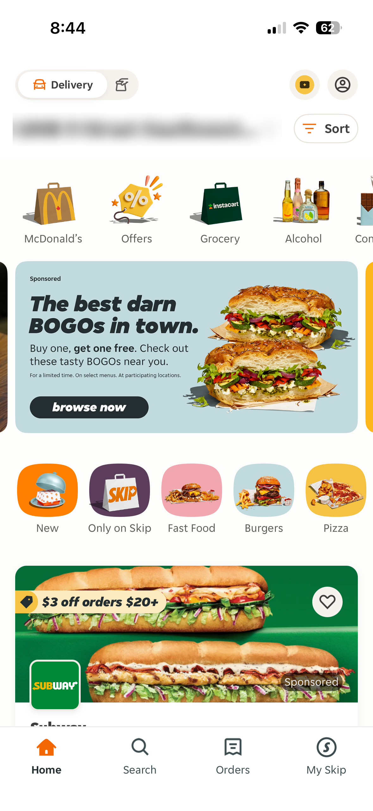
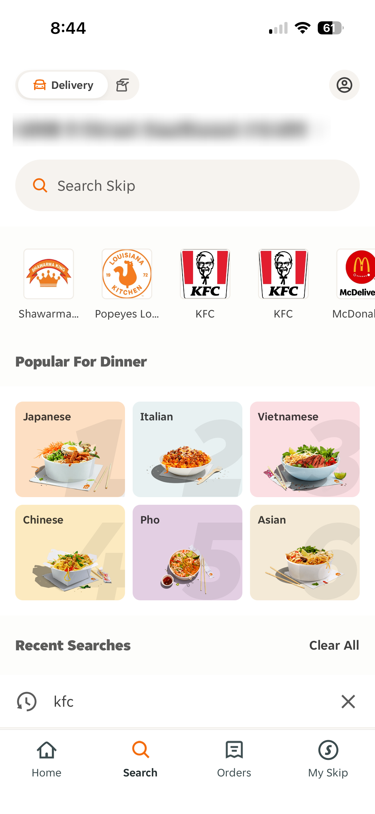
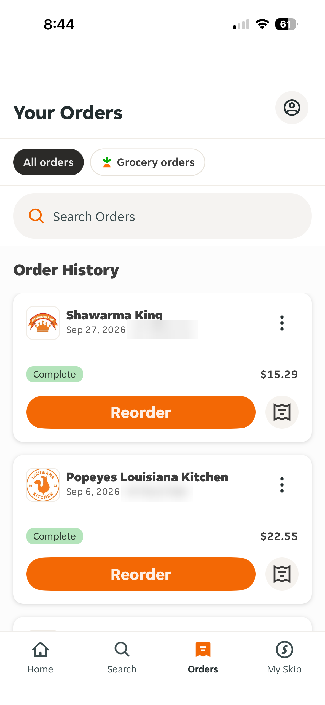
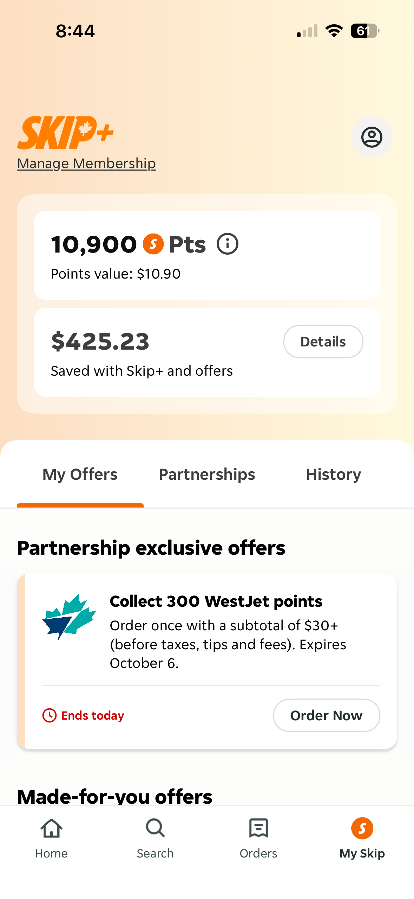
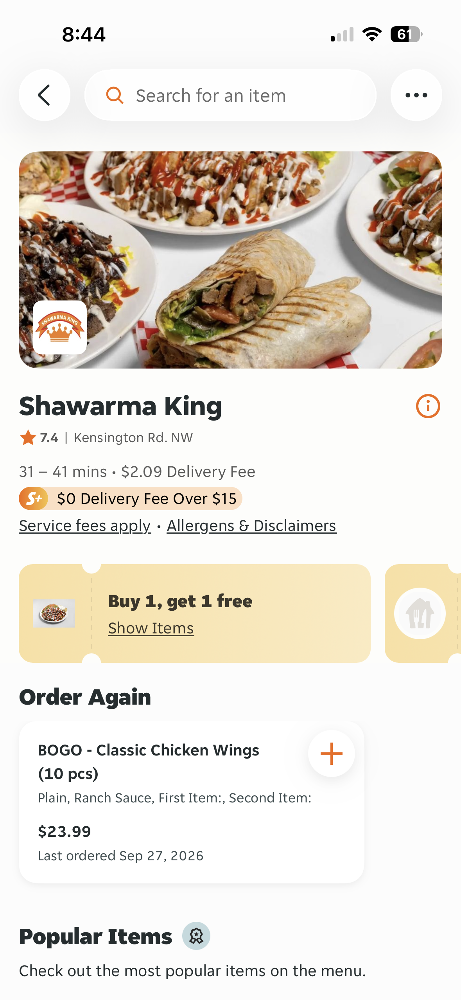
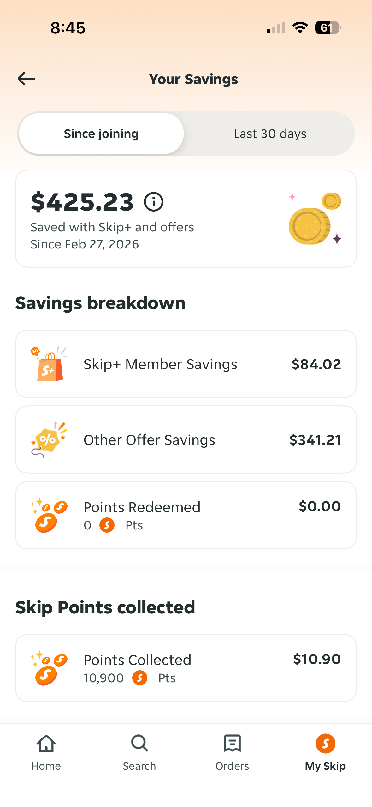

# Skip Clone – CPRG 303 Assignment 2

**Student:** Mary Ann Coloma
**Student ID:** 000974479
**Course:** CPRG 303 – Mobile Application Development (SAIT)
**Assignment:** Advanced Multi-Screen Mobile Application with Collaborative Navigation (Expo)

A recreation of the **SkipTheDishes** mobile app layout using Expo, Expo Router and TypeScript. The app has 4 tab screens and 2 stack screens, built with reusable typed components and mock data.

---

## Reference App (SkipTheDishes)

| Home                                           | Search                                           | Orders                                           |
| ---------------------------------------------- | ------------------------------------------------ | ------------------------------------------------ |
|  |  |  |

| My Skip                                           | Restaurant                                           | Your Savings                                      |
| ------------------------------------------------- | ---------------------------------------------------- | ------------------------------------------------- |
|  |  |  |

Personal info (address, order numbers) was blurred in the screenshots.

---

## How to Run

```bash
npm install
npx expo start
```

Then scan the QR code with Expo Go, or press `w` for web.

Tested on: iPhone (Expo Go).

---

## Screens and Navigation

```
src/app/
  _layout.tsx          Stack (root) – wraps the tabs and the stack screens
  (tabs)/
    _layout.tsx        Tabs – Home, Search, Orders, My Skip
    index.tsx          Home
    search.tsx         Search
    orders.tsx         Orders
    my-skip.tsx        My Skip
  restaurant.tsx       Stack screen – restaurant details
  savings.tsx          Stack screen – savings breakdown
```

- **Tab navigation:** 4 tabs using `<Tabs>` with Ionicons.
- **Stack navigation:** the root `<Stack>` holds the tab group plus `restaurant` and `savings`, so these screens open on top of the tabs (no tab bar) and have a back button using `router.back()`.

**Stack flows:**

- Home (restaurant card) → Restaurant
- Search (restaurant logo) → Restaurant
- Orders (Reorder button) → Restaurant
- My Skip (Details button) → Your Savings
- My Skip (Order Now) → Restaurant

Navigation uses both `<Link href asChild>` (Details button) and `router.push()` (inside card `onPress` handlers).

---

## Dynamic Content

- Lists rendered from mock data with `.map()` and `FlatList` (Orders).
- **Search filtering** on Search, Orders and Restaurant screens (controlled `TextInput` + `.filter()`).
- **Interactive state** with `useState`: delivery/pickup toggle, order filter chips, My Skip tabs, Since joining / Last 30 days toggle, add-to-cart button on menu items, removing recent searches.
- Optional props (`offer?`, `lastOrdered?`, `points?`) only render when provided.

---

## Component Organization

### Rules I followed

1. **Own file in `components/`** when a component is used on more than one screen, repeated in a list, or is big enough to clutter the screen file.
2. **Same file as the screen** when it is small and only used by that one screen. These are written below the screen component with a comment.
3. **One component per file**, file name matches the component name (PascalCase), `export default` at the bottom.
4. **Props are typed** with a TypeScript `interface` above each component. Optional props use `?`.
5. **Styles** use `StyleSheet.create` at the bottom of each file, no inline style objects except dynamic values (like a color from data).
6. **Colors** come from `constants/Colors.ts`, so there are no hardcoded hex values in components.
7. **Spacing** is done with `gap`, `padding` and `margin`, never with spaces in text.
8. **Icons** come from `@expo/vector-icons` (Ionicons), no unicode symbols.

### Components in their own files

| Component        | Used in                                                       | Why its own file                      |
| ---------------- | ------------------------------------------------------------- | ------------------------------------- |
| `IconButton`     | Home, Search, Orders, My Skip, Restaurant, Savings, OrderCard | Used on every screen                  |
| `SearchBar`      | Search, Orders, Restaurant                                    | Used on 3 screens                     |
| `DeliveryToggle` | Home, Search                                                  | Used on 2 screens                     |
| `AddressRow`     | Home, Search                                                  | Used on 2 screens                     |
| `SkipCoin`       | My Skip, Savings, SavingsRow                                  | Used in several places                |
| `RestaurantCard` | Home                                                          | Repeated in a list and large          |
| `CategoryItem`   | Home                                                          | Repeated in a list                    |
| `FoodTypeTile`   | Home                                                          | Repeated in a list                    |
| `RestaurantLogo` | Search                                                        | Repeated in a list                    |
| `CuisineTile`    | Search                                                        | Repeated in a grid                    |
| `OrderCard`      | Orders                                                        | Repeated in a FlatList and large      |
| `OfferCard`      | My Skip                                                       | Repeated in a list                    |
| `MenuItemCard`   | Restaurant                                                    | Used in 2 sections, has its own state |
| `SavingsRow`     | Savings                                                       | Repeated 4 times                      |

### Components kept in the same file

| Component     | Screen     | Why same file                |
| ------------- | ---------- | ---------------------------- |
| `PromoBanner` | Home       | Only used once, only on Home |
| `FilterChip`  | Orders     | Small, only used on Orders   |
| `OfferTicket` | Restaurant | Only used on Restaurant      |
| `RangeToggle` | Savings    | Only used on Savings         |

**Example of the decision changing:** `DeliveryToggle` and the address row started inside the Home file. When I built the Search screen and needed them again, I moved them into `components/` so the code is not duplicated.

### Other folders

- `src/constants/Colors.ts` – color palette
- `src/data/mockData.ts` – TypeScript interfaces and all mock data
- `screenshots/` – reference screenshots of the real app

---

## Simplifications from the Real App

- **Gradients** on My Skip and Savings → solid peach background.
- **Food photos** → colored placeholder areas with an icon.
- **Brand logos** → colored boxes with initials.
- **Data** → fictional restaurants, orders and address (no real personal data).
- **Long feeds** → only the content shown in the reference screenshots.

---

## Requirements Checklist

- [x] Real app reference with 3+ related screenshots (6 included)
- [x] Expo project with TypeScript template (`create-expo-app@latest`, SDK 57)
- [x] At least 4 functional screens (6 total)
- [x] Tab navigation combined with stack navigation
- [x] Structured layout, icons (Ionicons) and consistent styling on every screen
- [x] Dynamic content: lists, FlatList, search filtering, reusable components
- [x] Reusable code broken into components
- [x] Clear rules for own file vs same file
- [x] TypeScript interfaces for all props
- [x] Pushed to GitHub

---

## Attributions

- **Reference app:** SkipTheDishes (Just Eat Takeaway.com). Recreated for educational purposes only. Screenshots taken from my own device.
- **Icons:** [Ionicons](https://ionic.io/ionicons) via [`@expo/vector-icons`](https://docs.expo.dev/guides/icons/) (MIT License).
- **Framework:** [Expo](https://expo.dev/) and [Expo Router](https://docs.expo.dev/router/introduction/).
- **Course material:** CPRG 303 lecture slides (file-based routing, core components, styling, reusable components).
- **Images:** no external images were used in the app. All visuals are made with Views, colors and icons.
- **AI use:** I used Claude (Anthropic) to help plan the project structure and generate starter code based on the concepts from our class slides. I reviewed, tested and adjusted the code, and made the decisions on which screens, components and simplifications to use.
